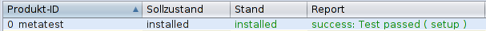

# Metatest

## OPSI-Testpaket fuer Modifikation(en) an opsi-script/opsi-winst

### Motivation

OPSI-Scripte koennen bei ihrer Beendigung verschiedene Status-Meldungen an
den Server zurueckgeben. Das spiegelt sich in entsprechenden Ausdruecken in
der Skriptsprache wider:

* <code>isSuccess</code>
* <code>isFatalError</code>
* <code>isSuspended</code>

Allein der Ausdruck <code>isFatalError</code> akzeptiert bislang (opsi-script v4.12.1.0)
einen (optionalen) Parameter, der spaeter im ***opsi config editor*** im Feld 
_report_ zu sehen ist.  
Diese Moeglichkeit soll auch fuer <code>isSuccess</code> gegeben sein.

### Umsetzung

Fuer die Erweiterung von opsi-script um die gewuenschte Funktionalitaet wurden
kleinere Anpassungen vorgenommen.  
Diese sind im [Branch des Fork auf Github](https://github.com/J-U-B/lazarus/tree/wip_issuccess)
zu finden.

Dieses OPSI-Paket setzt fuer seine Funktion zwingend ein entsprechend modifiziertes
opsi-script/opsi-winst voraus.

### Das Resultat

Das Ergebnis der koennte folgendermassen aussehen:

### Offene Fragen/ToDo

Im Falle eines Fehlers liefert z.B.:
> <code>isFatalError</code> "unknown exception"

im _opsi config editor_ den Report-String:
> *failed: unknown exception ( setup ) failed*

Das abschliessende _failed_ koennte dabei durchaus entfallen, sofern es intern
keine Funktion erfuellt. _(Wo kommt das her?)_

Derzeit liefert ein 
> <code>isSuccess</code> "Test passed"

den Report-String:
> *Test Passed ( setup )*

Hierbei ist die Farbgebung jedoch neutral; die Schrift erscheint nicht gruen 
wie sonst bei erfolgreicher Ausfuehrung.  
Erst 
> <code>isSuccess</code> "success: Test passed"

liefert das gewuenschte Bild: 
> *success: Test Passed ( setup )*

Um dieses Resultat zu erzielen, sind jedoch noch Anpassungen ausserhalb von
opsi-script erforderlich. _(Wo? python-opsi?)_

### Sonderfall isSuspended

Der Ausdruck <code>isSuspended</code> bricht die Scriptabarbeitung ab, wobei
kein Erfolg oder Fehler gemeldet wird. Der ActionRequest bleibt hierbei unveraendert.

Auch <code>isSuspended</code> koennte um einen optionalen Parameter erweitert werden.
Da in diesem Fall jedoch (seitens opsi-script) keine Aktualisierung der Objektdaten
erfolgt, wurde auf eine Anpassung von opsi-script vorerst verzichtet.

Das Setzen eines Report-Strings kann hier die Funktion **<code>currentProductSetReport</code>**
aus der beiliegenden Bibliothek helpers.opsifunc uebernehmen.

-----
Jens Boettge, 2019-08-08 17:43:26 +0200
